# cave-ecosystem

Mapping packages and services in the CAVE ecosystem

## Diagram (WIP)

```mermaid
flowchart TD
    caveclient[CAVEclient]
    click caveclient "https://github.com/seung-lab/CAVEclient" "CAVEclient GitHub"

    pychunkedgraph[PyChunkedGraph]
    click pychunkedgraph "https://github.com/seung-lab/pychunkedgraph" "PyChunkedGraph GitHub"

    neuroglancer-json[Neuroglancer JSON Service]
    click neuroglancer-json "https://github.com/seung-lab/NeuroglancerJsonServer" "Neuroglancer JSON Service GitHub"

    info[Info Service]
    click info "https://github.com/seung-lab/AnnotationFrameworkInfoService" "Info Service GitHub"

    annotation-schemas[EM Annotation Schemas]
    click annotation-schemas "https://github.com/seung-lab/EmAnnotationSchemas" "EM Annotation Schemas GitHub"

    annotation-engine[Annotation Engine]
    click annotation-engine "https://github.com/seung-lab/AnnotationEngine" "Annotation Engine GitHub"

    neuroglancer-annotation[Neuroglancer Annotation UI]
    click neuroglancer-annotation "https://github.com/seung-lab/NeuroglancerAnnotationUI" "Neuroglancer Annotation UI GitHub"

    l2cache[PCG L2 Cache]
    click l2cache "https://github.com/seung-lab/PCGL2Cache" "PCG L2 Cache GitHub"

    pcg-skeleton[pcg_skel]
    click pcg-skeleton "https://github.com/AllenInstitute/pcg_skel" "pcg_skel GitHub"

    subgraph cloud
        pychunkedgraph
        neuroglancer-json
        info
        annotation-schemas
        annotation-engine
        l2cache
    end

    subgraph client
        caveclient
        neuroglancer-annotation
        pcg-skeleton
    end

    caveclient <--> pychunkedgraph
    caveclient <--> neuroglancer-json
    caveclient <--> info
    caveclient <--> annotation-schemas
    caveclient <--> annotation-engine
    caveclient --> neuroglancer-annotation
    caveclient --> l2cache
    caveclient --> pcg-skeleton
```

## I want to...

### User-facing

#### Download image data

[cloud-volume][]

#### Download segmentation data

[CAVEclient][]

#### Make nice visualizations of imagery and segmentation

[ImageryClient][]

#### Download synapse data

[CAVEclient][]

#### Work with neuron anatomy data (e.g. skeletons, meshes)

[MeshParty][]

[navis][]

#### Create skeletons from PyChunkedGraph segmentations

[pcg_skel][]

#### Programatically generate Neuroglancer links, potenrially with annotations

[NeuroglancerAnnotationUI][]

### Developer-facing

<!-- Package manifest -->

[CAVEclient]: https://github.com/seung-lab/CAVEclient
[cloud-volume]: https://github.com/seung-lab/cloud-volume
[ImageryClient]: https://github.com/AllenInstitute/ImageryClient
[MeshParty]: https://github.com/sdorkenw/MeshParty
[pcg_skel]: https://github.com/AllenInstitute/pcg_skel
[NeuroglancerAnnotationUI]: https://github.com/seung-lab/NeuroglancerAnnotationUI
[navis]: https://github.com/navis-org/navis
