# CAVE ecosystem <!-- omit in toc -->

Mapping packages and services in the CAVE ecosystem.

- [What is the CAVE ecosystem?](#what-is-the-cave-ecosystem)
- [I want to...](#i-want-to)
  - [As a user...](#as-a-user)
    - [Download image data](#download-image-data)
    - [Download segmentation data](#download-segmentation-data)
    - [Make nice visualizations of imagery and segmentation](#make-nice-visualizations-of-imagery-and-segmentation)
    - [Download synapse data](#download-synapse-data)
    - [Download cell annotations](#download-cell-annotations)
    - [View the proofreading edit history of neurons](#view-the-proofreading-edit-history-of-neurons)
    - [Do computations on neuron anatomy data (e.g. skeletons, meshes)](#do-computations-on-neuron-anatomy-data-eg-skeletons-meshes)
    - [Visualize neuron anatomy data](#visualize-neuron-anatomy-data)
    - [Create skeletons from PyChunkedGraph segmentations](#create-skeletons-from-pychunkedgraph-segmentations)
    - [Work with saved Neuroglancer states](#work-with-saved-neuroglancer-states)
    - [Programatically generate Neuroglancer links, potentially with annotations](#programatically-generate-neuroglancer-links-potentially-with-annotations)
  - [As a learner...](#as-a-learner)
    - [View the educational materials from the 2023 SWDB](#view-the-educational-materials-from-the-2023-swdb)
  - [As a data-generator...](#as-a-data-generator)
    - [Guide proofreaders to points of interest in chunkedgraph-based segmentations](#guide-proofreaders-to-points-of-interest-in-chunkedgraph-based-segmentations)
  - [As a developer...](#as-a-developer)
    - [View the PyChunkedGraph code](#view-the-pychunkedgraph-code)
    - [View the Neuroglancer JSON Service code](#view-the-neuroglancer-json-service-code)
    - [View the Info Service code](#view-the-info-service-code)
    - [View the EM Annotation Schemas code](#view-the-em-annotation-schemas-code)
    - [View the Annotation Engine code](#view-the-annotation-engine-code)
    - [View the L2 Cache code](#view-the-l2-cache-code)
- [Diagram (WIP)](#diagram-wip)

## What is the CAVE ecosystem?

CAVE is short for "Connectome Annotation Versioning Engine". It is a system for storing,
interacting with, and versioning nanoscale [connectome](https://en.wikipedia.org/wiki/Connectome) data.

What we'll call the CAVE "ecosystem" is a loose collection of software packages and
services that can be useful for interacting with this data.

These packages are maintained by a wide variety of people and teams and credit for their development goes to them. We're not claiming all of these packages are developed by us or that these packages are all part of CAVE - this page is just trying to point people to open-source tools that can be useful for working with this connectome data.

## I want to...

### As a user...

#### Download image data

[cloud-volume][]

#### Download segmentation data

[CAVEclient][]

#### Make nice visualizations of imagery and segmentation

[ImageryClient][]

#### Download synapse data

[CAVEclient][]

#### Download cell annotations

[CAVEclient][]

#### View the proofreading edit history of neurons

[CAVEclient][]

#### Do computations on neuron anatomy data (e.g. skeletons, meshes)

[MeshParty][]

[navis][]

#### Visualize neuron anatomy data

[skeleton_plot][]

[navis][]

#### Create skeletons from PyChunkedGraph segmentations

[pcg_skel][]

#### Work with saved Neuroglancer states

[CAVEclient][]

#### Programatically generate Neuroglancer links, potentially with annotations

[NeuroglancerAnnotationUI][]

### As a learner...

#### View the educational materials from the 2023 SWDB

[SWDB-2023-book][]

---

### As a data-generator...

#### Guide proofreaders to points of interest in chunkedgraph-based segmentations

[Guidebook][]

---

### As a developer...

#### View the PyChunkedGraph code

[PyChunkedGraph][]

#### View the Neuroglancer JSON Service code

[NeuroglancerJsonServer][]

#### View the Info Service code

[AnnotationFrameworkInfoService][]

#### View the EM Annotation Schemas code

[EMAnnotationSchemas][]

#### View the Annotation Engine code

[AnnotationEngine][]

#### View the L2 Cache code

[PCGL2Cache][]

---

## Diagram (WIP)

```mermaid
flowchart TD
    caveclient[CAVEclient]
    click caveclient "https://github.com/seung-lab/CAVEclient" "CAVEclient GitHub"

    pychunkedgraph[PyChunkedGraph]
    click pychunkedgraph "https://github.com/seung-lab/pychunkedgraph" "PyChunkedGraph GitHub"

    neuroglancer-json[Neuroglancer JSON Service]
    click neuroglancer-json "https://github.com/seung-lab/NeuroglancerJsonServer" "Neuroglancer JSON Service GitHub"

    info[Info Service]
    click info "https://github.com/seung-lab/AnnotationFrameworkInfoService" "Info Service GitHub"

    annotation-schemas[EM Annotation Schemas]
    click annotation-schemas "https://github.com/seung-lab/EmAnnotationSchemas" "EM Annotation Schemas GitHub"

    annotation-engine[Annotation Engine]
    click annotation-engine "https://github.com/seung-lab/AnnotationEngine" "Annotation Engine GitHub"

    neuroglancer-annotation[Neuroglancer Annotation UI]
    click neuroglancer-annotation "https://github.com/seung-lab/NeuroglancerAnnotationUI" "Neuroglancer Annotation UI GitHub"

    l2cache[PCG L2 Cache]
    click l2cache "https://github.com/seung-lab/PCGL2Cache" "PCG L2 Cache GitHub"

    pcg-skeleton[pcg_skel]
    click pcg-skeleton "https://github.com/AllenInstitute/pcg_skel" "pcg_skel GitHub"

    subgraph cloud
        pychunkedgraph
        neuroglancer-json
        info
        annotation-schemas
        annotation-engine
        l2cache
    end

    subgraph client
        caveclient
        neuroglancer-annotation
        pcg-skeleton
    end

    caveclient <--> pychunkedgraph
    caveclient <--> neuroglancer-json
    caveclient <--> info
    caveclient <--> annotation-schemas
    caveclient <--> annotation-engine
    caveclient --> neuroglancer-annotation
    caveclient --> l2cache
    caveclient --> pcg-skeleton
```

<!-- Package manifest -->

[AnnotationEngine]: https://github.com/seung-lab/AnnotationEngine
[AnnotationFrameworkInfoService]: https://github.com/seung-lab/AnnotationFrameworkInfoService
[CAVEclient]: https://github.com/seung-lab/CAVEclient
[cloud-volume]: https://github.com/seung-lab/cloud-volume
[EMAnnotationSchemas]: https://github.com/seung-lab/EmAnnotationSchemas
[Guidebook]: https://github.com/AllenInstitute/Guidebook
[ImageryClient]: https://github.com/AllenInstitute/ImageryClient
[MeshParty]: https://github.com/sdorkenw/MeshParty
[navis]: https://github.com/navis-org/navis
[NeuroglancerAnnotationUI]: https://github.com/seung-lab/NeuroglancerAnnotationUI
[NeuroglancerJsonServer]: https://github.com/seung-lab/NeuroglancerJsonServer
[pcg_skel]: https://github.com/AllenInstitute/pcg_skel
[PCGL2Cache]: https://github.com/seung-lab/PCGL2Cache
[PyChunkedGraph]: https://github.com/seung-lab/pychunkedgraph
[skeleton_plot]: https://github.com/AllenInstitute/skeleton_plot
[SWDB-2023-book]: https://allenswdb.github.io/microns-em/em-background.html
